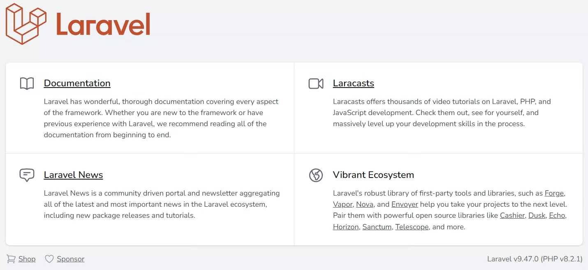

<!-- omit in toc -->
# 2023-01-10 株式会社ユアシス laravel-sail on WSL 環境構築手順書

## 1. ドキュメントの作成者

湯浅信彦( yuasys+nob@gmail.com)  

## 2. 改訂履歴

- 0.1
  - 作成日時: 2023-01-10 17:00:00
  - 更新内容: 新規作成（ドラフト版）
  
## 3. このドキュメントの目次

- [1. ドキュメントの作成者](#1-ドキュメントの作成者)
- [2. 改訂履歴](#2-改訂履歴)
- [3. このドキュメントの目次](#3-このドキュメントの目次)
- [4. このドキュメントの目的・概要](#4-このドキュメントの目的概要)
- [5. 適用範囲](#5-適用範囲)
- [6. 前提条件](#6-前提条件)
  - [6.1. 作業端末](#61-作業端末)
  - [作業用ディレクトリ](#作業用ディレクトリ)
  - [6.2. 知識](#62-知識)
- [7. 作業手順](#7-作業手順)
  - [7.1. 必須作業](#71-必須作業)
  - [7.2. オプション作業（必要に応じ作業する）](#72-オプション作業必要に応じ作業する)
- [8. 作業完了条件](#8-作業完了条件)
- [9. 作業者](#9-作業者)
- [10. 副作業者（検証者）](#10-副作業者検証者)
- [11. 作業場所](#11-作業場所)
- [12. 作業端末](#12-作業端末)
- [13. 予定作業時間](#13-予定作業時間)
- [14. その他制約事項・備考](#14-その他制約事項備考)
  - [14.1. VScodeの便利な拡張機能で生産性UP](#141-vscodeの便利な拡張機能で生産性up)
    - [14.1.1. 拡張機能のインストール](#1411-拡張機能のインストール)
    - [14.1.2. 章・節などに連番を自動で振る](#1412-章節などに連番を自動で振る)
    - [14.1.3. 目次を自動生成する](#1413-目次を自動生成する)

## 4. このドキュメントの目的・概要

社内のシステム開発業務担当者が laravel sail 環境を構築するための手順書。
この手順書にしたがって必要な開発環境を揃えることにより、環境の違いによる作業の発生を抑制し、本質的なシステム開発作業により多くの時間を当てことを可能にする。

## 5. 適用範囲

作業用ディレクトリを新規に作成して、laravel sail の雛形を導入し、ブラウザに初期画面が表示され,sailの初期設定が完了するまで。

## 6. 前提条件

### 6.1. 作業端末

1. OSはWindwos11で、かつwslが動作していること
2. `Docker`または`Docker Desktop`が導入され、起動していること
3. 標準的なコードエディタとして`VSCode`が導入されていること

### 作業用ディレクトリ

1. wsl領域（linux/ubuntu）内であること
   ※Windows側からもマウント可能だが、読み書きが遅くなるので、最適な作業が出来ない恐れがある。なので、直接wslのディレクトリを参照すべきと考えられる。
2. ユーザのホームディレクトリ(~)配下であること<br> 例：/home/nob

```bash
$ pwd  #現在の場所を表示するコマンド
/home/nob/source/task-procedures
$ cd ~ #wslユーザーのホームに移動
$ pwd　#現在の場所を表示するコマンド
/home/nob
```

### 6.2. 知識

用語の理解：`Docker` `Laravelフレームワーク`

## 7. 作業手順

### 7.1. 必須作業

| No |TaskName |Terminal Command or Task Contents| Note |
|----|----|--------------------------------------------------|---------------------------------------------------|
| 1  | 導入 |$ curl -s <https://laravel.build/><i>example-app</i> \| bash | このURLの"example-app"は任意に変更できる。ただし、アプリケーション名は英数字とハイフン、アンダーバーだけで構成すること。Laravelアプリケーションのディレクトリは、コマンドを実行したディレクトリ内に作成される。 |
| 2 |移動|$ cd <i>example-app</i>|アプリケーション（プロジェクト）ルートに移動|
|3|起動（デーモン）|$ ./bendor/bin/sail up -d |Sailを起動デーモン：バックグランドでの起動実行|
|4|確認|ブラウザで http://localhost にアクセスする<br>右のイメージが表示されれば、成功 ||
|5|停止|$ ./bendor/bin/sail stop ||
|6|初期設定|ファイル <b>config/app.php</b> の編集<br> 72行付近 <b> 'timezone' => 'Asia/Tokyo' </b><br> 85行付近 <b>'local' => 'ja'</b> ||

### 7.2. オプション作業（必要に応じ作業する）

## 8. 作業完了条件

## 9. 作業者

## 10. 副作業者（検証者）

## 11. 作業場所

## 12. 作業端末

## 13. 予定作業時間

## 14. その他制約事項・備考

### 14.1. VScodeの便利な拡張機能で生産性UP

#### 14.1.1. 拡張機能のインストール

1. Markdown All in One
2. Markdown Preview Enhanced

#### 14.1.2. 章・節などに連番を自動で振る

コマンドパレットでsectionなどと入力すると以下の様に<b>'Markdown All in One: Add/Update section numbers'</b>が表示されるので、それをクリックまたは選択・Enter押下する。 


#### 14.1.3. 目次を自動生成する

目次を追加したい箇所にカーソルを合わせた状態で、VSCodeのコマンドパレットを開き、コマンドパレットで<b>TOC</b>などと入力すると、以下の様に<b>Markdown All in One: Create Table of Contents</b>が表示されるので、それをクリックまたは選択・Enter押下する。

